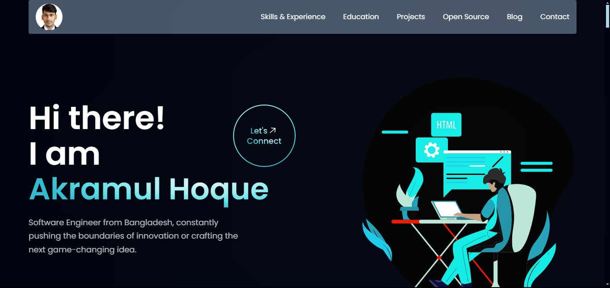

<h1 align="center"> Akramul Hoque Personal Portfolio </h1>



### Deployed link: <a href="https://akramulhoque-profile.areiatech.com/" target="_blank">akramulhoque-profile.areiatech.com</a>

## Table of Contents 📁

1. [Technology Stack](#technology-stack-)
2. [Implemented Sections](#implemented-sections-%EF%B8%8F)
3. [Contributing](#contributing-)
4. [Installation Guide](#installation-guide-)
5. [References & Inspirations](#references--inspirations-)
6. [Illustrations](#illustrations-%EF%B8%8F)

<br>

## Technology Stack 🧰

<li>Frameworks</li>

- [ReactJS](https://reactjs.org/)
- [Tailwind CSS](https://tailwindcss.com/)

<li>Libraries/Tools</li>
    
- [ViteJS](https://vitejs.dev/)
- [React Icons](https://react-icons.github.io/react-icons")
- [Framer](https://www.framer.com/)
- [React Lottie](https://www.npmjs.com/package/react-lottie)
- [Meraki UI](https://merakiui.com/components/)

<br/>

## Implemented Sections ☑️

- Hero Section
- Skills & Experience
- Education
- Projects
- Blogs
- Open Source Contributions
- Extra Curricular
- Contact Me

## Contributing 🏆

We welcome contributions in the form of pull requests, issues and documentation. Feel free to help us in any way! ❤️

- Please read and abide by our [Code of Conduct](https://github.com/engr-akramulhoque/personal-portfolio/blob/master/CODE_OF_CONDUCT.md);
  our community aspires to be a respectful place both during online and in-person interactions.
- Please follow the [installation guide](https://github.com/engr-akramulhoque/personal-portfolio/tree/master?tab=readme-ov-file#installation-guide-) to contribute.

## Installation Guide 🧑‍💻

### Using Git and Github

### Clone the Repository

```bash
  git clone https://github.com/engr-akramulhoque/personal-portfolio.git
```

### Install required packages

```bash
  cd personal-portfolio
```

```bash
  npm install
```

### Run server

```bash
  npm run dev
```

<br/>

## References & Inspirations 👏

- [JavaScript Mastery](https://youtu.be/_oO4Qi5aVZs)
- [Developerfolio](https://developerfolio.js.org/)
- [MasterPortfolio](https://github.com/ashutosh1919/masterPortfolio)

## Illustrations 🖼️

- [Coding Lottie](https://lottiefiles.com/90189-coding) by Yamesh Sai Balaji
- [Quiz Mode Lottie](https://lottiefiles.com/92377-quiz-mode) by SenecaDan
