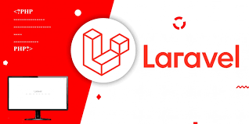

## Mastering Laravel: Best Practices for Scalable Applications

### Introduction

Laravel is a powerful PHP framework that makes building web applications easier. However, ensuring scalability requires following best practices.

### Key Best Practices

- **Use Service Providers**: Keep application logic modular.
- **Optimize Database Queries**: Use Eloquent wisely and avoid N+1 queries.
- **Leverage Caching**: Utilize Redis or Memcached to speed up performance.
- **Queue Jobs**: Offload heavy tasks like email processing.

### Conclusion

By following these best practices, you can build a Laravel application that scales efficiently and performs well under heavy loads.
